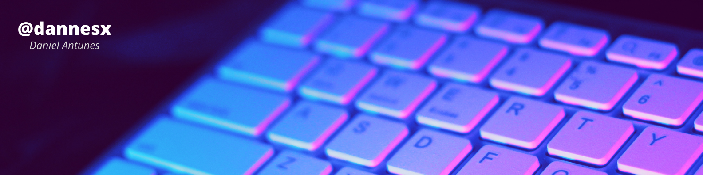

<h1>Tela de Login - Dark Theme</h1>

 &nbsp;
 

>Projeto de tela de Login em dark theme, baseado no [vídeo tutorial](https://www.youtube.com/watch?v=wALFIHlLYiU) de [Marcosuel Vieira](https://github.com/lexmarcos)
## 💻 Sobre o Projeto

Projeto desenvolvido com o propósito de estudar HTML e CSS, a fim de aprofundar as qualidades técnicas necessárias para me preparar no ingresso ao mercado de trabalho como Front-End!

## 🚀 Tecnologias e Ferramentas

*Este projeto foi desenvolvido com:*

- HTML5
- CSS3
- VSCode
- Git & GitHub Pages

## 📚 Aprendizado

*Neste projeto eu pratiquei:*

- Criação de formulário HTML
- Desenvolvimento de aplicação baseado no design de outra pessoa
- Utilização de variáveis CSS declaradas no `--root`
- CSS Flexbox

## ⚙️ Materiais Utilizados

- Google Fonts: [Noto Sans](https://fonts.google.com/specimen/Noto+Sans)
- Vetor: [Storyset](https://storyset.com)

## 💻 Telas

*Você pode conferir o projeto [clicando aqui!](https://dannesx.github.io/login-dark/)*

 

## 🤖 Créditos & Agradecimentos

*Sem eles, este projeto não seria possível!*

- [Marcosuel Vieira](https://github.com/lexmarcos)

## 📋 Licença

Este projeto está sob a licença [MIT](LICENSE). Projeto realizado apenas para fins didáticos. Fique à vontade para utilizar todo o conteúdo deste repositório!

---

Obrigado pela atenção! 😃